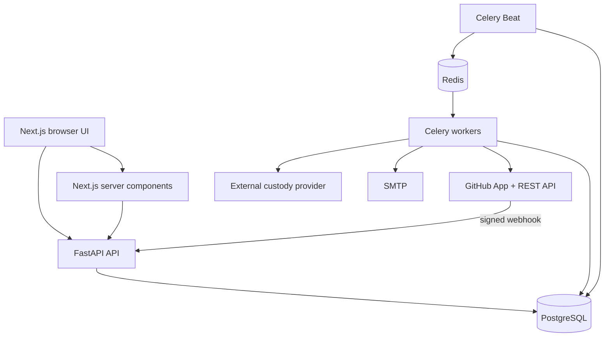
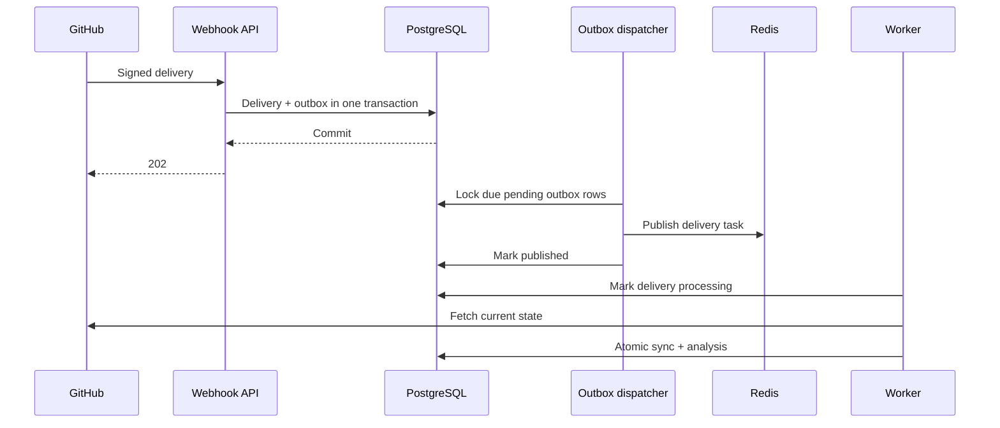

# GitHub Bounty Dispenser — Detailed Project Analysis

## 1. Document purpose

This document describes the project as implemented in this workspace on
2026-07-25. It covers architecture, domain boundaries, data flow, state machines,
security, consistency, scoring, review, bounties, AI, notifications, payout
integration, the showcase environment, testing, operational risks, and the next
recommended engineering work.

The document distinguishes between:

- **implemented behavior**: present in the current backend, frontend, migrations, or
  tests;
- **configured integrations**: implemented adapters that still require external
  credentials or infrastructure;
- **demo behavior**: explicitly non-production support for rehearsing the product;
- **future work**: capabilities that should not be inferred from the current code.

## 2. Executive summary

GitHub Bounty Dispenser is a multi-tenant contribution review and reward platform.
Its central design principle is that a webhook, score, AI response, human review,
approval, claim, and payout are different facts with different consistency and
authorization requirements.

The application does not treat a merged PR as payable. Instead, it builds a chain of
evidence:

```mermaid
flowchart LR
    GH["GitHub event"] --> INGEST["Durable ingestion"]
    INGEST --> SNAPSHOT["Current GitHub snapshot"]
    SNAPSHOT --> ANALYSIS["Versioned deterministic analysis"]
    ANALYSIS --> POLICY["Eligibility policy evaluation"]
    POLICY --> REVIEW["Human review"]
    REVIEW --> APPROVAL["Independent approval"]
    APPROVAL --> BOUNTY["Bounty claim"]
    BOUNTY --> AUTH["Treasury authorization"]
    AUTH --> SUBMIT["Provider submission"]
    SUBMIT --> CONFIRM["Provider confirmation"]
```



The strongest parts of the current system are:

- database-backed webhook deduplication;
- a transactional outbox between PostgreSQL and Celery/Redis;
- current-state GitHub fetching rather than trusting stale webhook payloads;
- complete paginated PR-file synchronization with explicit incomplete handling;
- independent lifecycle, review, ingestion, eligibility, and payout states;
- tenant and repository authorization derived from GitHub identity;
- immutable, reproducible score and policy history;
- human separation of duties before eligibility;
- immutable claim and payout financial snapshots;
- provider-neutral treasury controls and reconciliation;
- durable operations, audit, and notification records;
- a fail-closed non-production showcase mode tied to real GitHub PR authors.

### 2.1 Four-batch hardening implemented

The July 25 hardening work is organized as four controlled batches.

**Batch 1 — payout safety**

- payout creation requires `treasury_account_id` and fails when payouts are disabled;
- manual state routes are hidden by default and cannot be enabled in production;
- `SUBMISSION_UNKNOWN` separates an ambiguous transport outcome from a provider
  rejection;
- recovery first calls `find_by_idempotency_key` and reuses the original key;
- reservations survive transient/ambiguous errors;
- terminal failure, cancellation, or exhausted recovery creates one idempotent
  `RELEASE` ledger entry;
- confirmation is provider-owned and protected by a deferred PostgreSQL trigger.

**Batch 2 — PostgreSQL correctness**

- approval services and routes acquire a row lock on the eligibility decision before
  revalidation, insert, approval count, and transition;
- tests are classified as `unit`, `integration`, and `concurrency`;
- local Compose includes an isolated `postgres_test` service;
- CI renders migrations offline and exercises upgrade/downgrade/upgrade;
- migration `0008` uses literal JSON that works in both online and `--sql` mode.

**Batch 3 — synchronization and tenant-aware UI**

- `github_pr_id` remains GitHub's global database identifier;
- `github_pr_number` stores the repository-scoped visible number with a unique
  `(repo_id, github_pr_number)` constraint;
- legacy rows are backfilled from signed delivery payloads and unresolved rows are
  explicitly audited instead of guessed; the operator script can page GitHub,
  match the global PR ID, and apply `NOT NULL` only after the audit reaches zero;
- delivery receipt stores repository full name/owner and resolves tenant/repository
  before outbox publication whenever installation or repository identity is known;
- frontend analysis reads use `AnalysisResult<T>` to distinguish ready, missing, and
  incomplete state;
- incomplete synchronization displays the GitHub 3,000-file limit, reason, last SHA,
  no authoritative score, and a permission-checked resync action;
- dashboard URLs include the organization slug and remember the last selection.
- tenant operations pages expose aggregate fleet health; platform-only worker detail
  and unresolved-delivery APIs require a GitHub ID in
  `PLATFORM_ADMIN_GITHUB_IDS` and otherwise return `404`.

**Batch 4 — advisory AI and isolated tools**

- an OpenAI Responses API adapter emits the strict advisory schema and stores
  provider/model/prompt/commit/request ID/usage/moderation provenance;
- review execution is queued as `app.worker.tasks.execute_ai_review`, with a pending
  database redispatcher closing the broker publication gap;
- user-authored complete/fail transitions are hidden outside an explicit
  non-production gate;
- exact-head GitHub archives can be mounted read-only into digest-pinned,
  network-disabled, resource-limited containers;
- runner statuses are `PASSED`, `FAILED`, `UNAVAILABLE`, `TIMED_OUT`, and
  `TOOL_ERROR`;
- normalized findings and raw stdout/stderr artifacts are stored separately.

The most important production gaps are:

- no production deployment manifests or end-to-end deployment topology;
- the OpenAI advisory adapter requires explicit API/model configuration and private
  repository transfer remains denied by default;
- no production custody service included; the Base Sepolia adapter expects a
  separately operated custody API;
- no inbound provider webhook/callback authentication path;
- limited product UI for performing review, bounty, and payout mutations directly;
- no full browser end-to-end test suite;
- local rate limiting uses a development fallback when Redis is absent;
- email depends on external SMTP configuration;
- the repository contains report artifacts and a small legacy directory that are not
  part of the runtime application.

## 3. Repository layout

The runtime product is split into two applications:

```text
Github_bounty_dispenser-main/
├── backend/
│   ├── app/
│   │   ├── analysis/          deterministic analyzer framework
│   │   ├── api/               FastAPI route modules and authorization
│   │   ├── core/              settings, JWT/encryption, rate limiting
│   │   ├── db/                engine and session lifecycle
│   │   ├── github/            GitHub JWT, API client, webhook receiver
│   │   ├── models/            SQLAlchemy domain models
│   │   ├── schemas/           Pydantic API contracts
│   │   ├── services/          domain/application services
│   │   └── worker/            Celery app and tasks
│   ├── alembic/               ordered PostgreSQL migrations
│   ├── scripts/               secret rotation and demo orchestration
│   ├── tests/                 backend unit/integration-style tests
│   └── compose.yml            local PostgreSQL and Redis
├── frontend/
│   ├── app/                   Next.js App Router pages
│   ├── components/            dashboard, PR, patch, auth, UI components
│   ├── lib/                   types and utilities
│   └── services/              browser and server API clients
├── ANALYSIS.md                this architecture analysis
└── DEMO_RUNBOOK.md            real-repository showcase procedure
```

Other root files are project-report documents, report generation scripts, and image
assets. `Github_bounty_dispenser/` contains a minimal legacy README/test files and is
not the active backend or frontend.

## 4. Technology stack

### Backend

- FastAPI for HTTP APIs;
- SQLAlchemy ORM for persistence;
- Alembic for migrations;
- PostgreSQL as authoritative state;
- Redis as Celery broker and distributed rate-limit store;
- Celery worker/Beat for asynchronous processing;
- Requests for GitHub and provider HTTP calls;
- PyJWT for signed application sessions;
- Fernet encryption for OAuth credentials;
- Pytest and FastAPI TestClient for automated verification.

### Frontend

- Next.js 16 App Router;
- React 19;
- TypeScript;
- Tailwind CSS 4;
- shadcn/Base UI primitives;
- Recharts for analytics visualization;
- server components for authenticated reads;
- small client components only where interaction is required.

### External systems

- GitHub App installation APIs and webhooks;
- GitHub OAuth user authorization;
- GitHub REST API for PR, files, reviews, checks, identity, installations, and
  repositories;
- SMTP when email notification delivery is configured;
- optional custody provider API for Base Sepolia;
- a public HTTPS ingress for GitHub webhook delivery.

## 5. Top-level runtime architecture



PostgreSQL is the system of record. Redis is not trusted with business state. Celery
results are ignored; worker outcomes are stored in delivery, analysis, notification,
treasury, attempt, and reconciliation tables.

## 6. Domain decomposition

The project is divided into related but independent domains:

1. **Identity and tenancy** — users, organizations, memberships, installations,
   repositories, repository permissions, encrypted OAuth credentials, audit logs.
2. **Webhook ingestion** — deliveries, outbox records, queue dispatch, retry and
   processing state.
3. **GitHub synchronization** — current PR lifecycle, review state, file snapshot,
   metrics, head SHA, timestamps, rate-limit observations.
4. **Deterministic analysis** — runs, analyzer results, policies, scores, evidence.
5. **Review and approval** — repository eligibility policies, decisions, reviews,
   findings, approvals.
6. **Bounties and claims** — issues, bounty policies, bounties, assignments, wallets,
   claims.
7. **AI review** — privacy policy, immutable request snapshot, advisory output,
   provider/cost/moderation metadata.
8. **Notifications and analytics** — domain events, channel policies, deliveries,
   operations telemetry, product aggregates.
9. **Payout integration** — payout snapshots, attempts, treasury accounts, distinct
   treasury approvals, ledger entries, balance snapshots, reconciliation.
10. **Demo orchestration** — tenant-scoped personas and scripts around a real
    synchronized PR.

This decomposition prevents accidental transitions such as “score above 70 means
paid” or “merged means eligible.”

## 7. Independent state machines

### Pull-request lifecycle

```text
draft ↔ open
open → closed
open → merged
closed → open
```

GitHub remains authoritative. For a `closed` action, `pull_request.merged` determines
whether the stored state is `merged` or `closed`.

### Review state

```text
not_requested → under_review
under_review → changes_requested
under_review → approved
changes_requested → approved
approved → under_review or changes_requested after current GitHub review changes
```

The worker computes current review state from the current PR and review list.
Dismissed reviews remove the dismissed reviewer's decisive state.

### Ingestion state

```text
received → queued → processing → complete
                              ↘ incomplete
                              ↘ failed
failed/incomplete → retry processing when policy permits
```

`incomplete` is not equivalent to failed. It means processing succeeded far enough
to identify a known boundary, such as the GitHub PR-file limit, but cannot produce
authoritative output.

### Eligibility state

```text
not_evaluated → ineligible
not_evaluated → eligible
eligible → claimed
claimed → paid
```

The detailed `EligibilityDecisionStatus` adds workflow states:

```text
pending_review → changes_requested
pending_review → pending_approval
pending_approval → eligible
pending_approval → ineligible
active decision → superseded when score or policy changes
```

### Payout state

```text
created → authorized → submitting → submitted → confirmed
                         ↘ failed ─────────────→ submitting
created → cancelled
```

Provider acceptance and confirmation are separate. Only confirmation marks the
claim, bounty, and PR paid.

## 8. Reliable webhook ingestion

### Request-path responsibilities

`POST /webhook/github` performs only:

1. read raw body;
2. verify HMAC SHA-256 with `GITHUB_WEBHOOK_SECRET`;
3. require `X-GitHub-Delivery` and `X-GitHub-Event`;
4. parse a JSON object;
5. calculate the payload SHA-256;
6. insert a `webhook_deliveries` row;
7. insert the one-to-one pending `webhook_outbox` row in the same transaction;
8. return `202 Accepted`.

If the delivery ID already exists, the unique constraint resolves the race and the
endpoint returns `200` with a duplicate result. An application-level “check then
insert” is not the deduplication guarantee.

### Transactional outbox

The outbox closes the PostgreSQL/Redis consistency gap:



Celery Beat dispatches pending records every two seconds. Publish failure increments
attempt state and leaves the record recoverable.

### Worker reliability

Celery configuration includes:

- late acknowledgements;
- reject-on-worker-loss;
- prefetch multiplier one;
- configurable hard and soft time limits;
- visibility timeout beyond the hard limit;
- retry on broker startup;
- task routing by workload;
- exponential processing backoff with jitter in task logic.

Processing is idempotent because:

- the delivery ID is unique;
- outbox is one-to-one with delivery;
- PR/user/repository records are upserted;
- current files are synchronized as a snapshot;
- analysis has a deterministic run key;
- scores and evidence have unique hashes/relationships;
- payout and attempt creation use idempotency keys;
- domain events and ledger entries use stable identities.

PostgreSQL advisory locks prevent concurrent processing of the same delivery and
serialize synchronization for the same repository/PR resource.

### Supported GitHub events

Intentional subscriptions:

- `pull_request`: opened, reopened, synchronize, closed, edited,
  ready_for_review, converted_to_draft, review_requested,
  review_request_removed;
- `pull_request_review`: submitted, dismissed;
- `check_run`: created, rerequested, completed, requested_action;
- `check_suite`: requested, rerequested, completed;
- `github_app_authorization`: revoked.

Unsupported events are recorded without pretending the product handles every GitHub
event.

## 9. GitHub current-state synchronization

The worker treats the webhook as a notification, not a full authoritative snapshot.
For supported PR-related deliveries it mints a short-lived installation token and
fetches:

- current pull request;
- current PR reviews;
- every retrievable current PR file;
- current check runs for the head SHA.

### Pagination and limits

PR files are fetched 100 per page. The client follows GitHub's `Link` header and has
a page-number fallback for intermediaries that strip pagination headers.

GitHub exposes at most 3,000 files through the PR-files endpoint. At the cap:

- delivery becomes `incomplete`;
- PR stores `GITHUB_FILE_LIMIT`;
- an incomplete/non-authoritative analysis record is created;
- the last complete file snapshot is preserved;
- no final authoritative score is produced;
- operations UI surfaces the limitation.

### Snapshot algorithm

All remote pages are fetched before database file mutation. Inside the synchronization
transaction:

1. stored current files are indexed by filename;
2. renamed entries reconcile `previous_filename`;
3. current files are inserted or updated;
4. counts, SHA, status, URLs, and patch metadata are refreshed;
5. absent old files become non-current with `removed_at`;
6. metrics are recomputed from current files only;
7. analysis is run or reused for the complete input;
8. lifecycle/head/timestamp/delivery pointers are updated atomically.

File history is retained through `is_current=false`; product reads use only current
rows.

### Patch semantics

Missing patch content is not treated as an empty change. Each file records whether a
patch is available and a status/reason that distinguishes available content from
binary, too-large, or not-returned content.

The current analyzers operate on API file metadata and available patches. Deeper
future static analysis should use a checked-out commit or repository archive rather
than assuming all code is present in patch fragments.

### Out-of-order protection

The PR stores:

- GitHub `updated_at`;
- head SHA;
- last processed delivery ID;
- last completely synchronized head SHA;
- synchronization timestamp.

Older GitHub state cannot overwrite a newer stored state. File synchronization always
fetches current GitHub data, so an old queued webhook does not blindly restore an old
payload.

## 10. Deterministic analysis and scoring

### Core properties

The engine is:

- reproducible from stored inputs and versions;
- independent of the UI;
- language-aware where file classification permits;
- evidence producing;
- explicit about uncertainty;
- immutable after completion.

An analysis run identity covers PR, head SHA, analyzer suite/manifest, scoring policy,
and input hash. Identical inputs reuse the existing result. A head, analyzer, policy,
or complete input change creates a distinct run.

### Analyzer contract

Each analyzer has a stable name, version, category, support predicate, and analysis
method. Output contains:

- status: available, unavailable, inconclusive, or error;
- optional numeric score;
- confidence;
- findings;
- evidence;
- errors;
- duration;
- deterministic result hash.

Tool absence or failure is never silently converted to a zero.

### Implemented analyzer categories

| Analyzer | Main evidence |
|---|---|
| Diff size/concentration | total changes, file count, largest-file concentration |
| Test-file changes | language-aware test classification and test/code ratio |
| Documentation changes | documentation path/name classification |
| Lint results | matching GitHub check conclusions |
| Complexity delta | matching complexity check conclusions |
| Duplication delta | matching duplication check conclusions |
| Function-size delta | matching function/method-size checks |
| Dependency changes | manifest/lockfile changes and breadth |
| Security findings | matching security check conclusions |
| CI/check status | aggregate GitHub check conclusions |

The check-based analyzers are evidence adapters, not local tool runners. Ruff, Bandit,
Radon, ESLint, Semgrep, coverage, and other tools should run in CI and expose check
results, or be added as isolated analyzer runners later.

### Default scoring policy

| Category | Weight |
|---|---:|
| Correctness | 30% |
| Tests | 20% |
| Maintainability | 15% |
| Security | 15% |
| Documentation | 5% |
| Architecture | 10% |
| Change risk | 5% |

Repository policy can change weights, per-analyzer weights, required analyzers, and
minimum confidence. The weights must define the exact category set, be non-negative,
and total 1.0.

Unavailable categories are excluded from the weighted score and reduce confidence.
Authority requires complete input, all policy-required analyzers, and sufficient
confidence.

### Immutability

`Score`, `ScoreEvidence`, and completed analyzer records are insert-only through
SQLAlchemy event guards and PostgreSQL migration protections. Policy changes create
new versions. `pull_requests.latest_score_id` is a pointer, not an overwrite of old
scores.

## 11. Identity, tenancy, and authorization

### Tenant boundary

Every repository belongs to an organization. Business records reach their tenant
through the repository or carry an explicit organization foreign key. Collection
queries filter by accessible repository; individual resource routes authorize before
returning data.

### Authentication

Normal interactive authentication uses GitHub App user authorization:

1. `/auth/github/start` creates OAuth state and a PKCE verifier/challenge;
2. state and verifier are stored in short-lived HTTP-only cookies;
3. callback compares state in constant time;
4. authorization code is exchanged;
5. GitHub user, memberships, installations, repositories, and permissions are
   synchronized;
6. OAuth tokens are encrypted;
7. a signed application session JWT is stored in an HTTP-only cookie.

Session JWTs contain subject, session version, unique ID, issue/not-before/expiry,
issuer, and audience. Key IDs support rotation. Incrementing `session_version`
revokes all prior sessions for a user.

### Token storage

- User OAuth tokens: encrypted at rest with a Fernet keyring.
- Installation tokens: never stored; minted when required.
- Treasury private keys: never accepted or stored.
- Demo access key: environment-only and compared in constant time.

### Authorization roles

Ordered roles:

```text
VIEWER < CONTRIBUTOR < REVIEWER < MAINTAINER < ADMIN < OWNER
```

Organization owners/admins have organization-wide authority. Other users require an
explicit repository permission. This prevents a generic organization membership
from exposing every private repository.

Denied repository access returns `404` to avoid confirming resource existence and
creates an audit record.

### GitHub revocation

`github_app_authorization.revoked`:

- removes the stored OAuth credential;
- removes GitHub-sourced repository permissions;
- deactivates GitHub-verified memberships;
- increments session version;
- records an audit event.

## 12. Review and approval domain

The default eligibility policy requires:

- merged PR;
- complete synchronized input;
- current score for the current head;
- authoritative score;
- minimum score 70;
- human review;
- one owner/admin approval;
- reviewer/approver separation;
- no author self-review;
- no author self-approval;
- no prior claimed/paid result.

Eligibility evaluation records every check, failure reason, score snapshot, score
version, policy version/hash, required approvals, and deterministic evaluation hash.

Human review records:

- reviewer identity;
- recommendation;
- summary;
- structured findings;
- finding severity/category/code/message/evidence;
- start/completion times.

Approval records:

- approver identity;
- approved/rejected outcome;
- reason;
- exact score ID and score-version ID;
- exact repository-policy ID.

A new score or policy supersedes a current pending decision. Historic decisions,
reviews, findings, and approvals remain auditable.

## 13. Bounty, claim, and provider-controlled payout domain

### Bounty prerequisites

An issue belongs to a repository and organization. A bounty snapshots:

- issue;
- repository and organization;
- bounty policy;
- eligibility policy;
- amount and currency;
- expiration;
- funding state;
- creator.

Default bounty policy allows USDC from 1 to 10,000 and requires funding,
assignment, a verified wallet, and a current eligibility decision.

### Assignment and claim checks

A claim is approved only when:

- bounty is funded and assigned;
- assignment belongs to the claimant;
- linked PR belongs to the repository;
- claimant authored the merged PR;
- current eligibility decision is eligible;
- eligibility policy matches the bounty snapshot;
- immutable approval exists;
- wallet belongs to claimant, is active, and is verified;
- no existing payable claim exists for the bounty.

The claim copies amount, currency, destination chain, destination address, approval,
PR, decision, wallet, and claimant into a financial snapshot.

### Manual state mutation is disabled

Payout creation requires a treasury account and is rejected while
`PAYOUTS_ENABLED=false`. Legacy authorize/attempt/submitted/failed/confirm endpoints
return `404` unless `ALLOW_MANUAL_PAYOUT_STATE=true` in a non-production process.
Production startup rejects that escape hatch. The demo uses the same treasury,
provider, reservation, submission, reconciliation, and confirmation services as
other payouts.

## 14. Provider-neutral treasury integration

### Provider interface

`PayoutProvider` defines:

- destination validation;
- idempotent submit;
- status polling;
- recovery lookup by the original provider idempotency key;
- explorer URL construction.

`TreasuryBalanceProvider` adds balance observation.

Built-in providers:

- `ledger`: off-chain behavior for controlled non-production flows; production
  treasury creation rejects this provider;
- `base_sepolia_custody`: HTTPS adapter to an external service that owns simulation,
  multisig/custody, broadcast, and provider status.

### Treasury controls

Every treasury is organization-scoped and created paused. It records:

- provider and environment;
- chain/currency/asset contract/decimals;
- treasury address and custody model;
- opening and observed balance;
- per-payout and daily limits;
- manual-approval threshold;
- standard and high-value approval count;
- required confirmations;
- simulation requirement;
- non-secret provider configuration;
- pause state/reason;
- creator and timestamps.

Provider configuration rejects key/token/password/secret material.

### Authorization and ledger

No normal payout can use manual attempt/confirmation endpoints. Treasury
authorization requires:

- matching immutable claim and approval;
- approver is not claimant;
- global pause cleared;
- treasury active;
- destination accepted by provider;
- sufficient distinct approvals;
- per-payout and daily limits pass;
- sufficient available ledger balance.

Authorization creates exactly one reservation:

```text
available -= amount
reserved  += amount
```

Provider confirmation creates exactly one settlement:

```text
reserved -= amount
settled  += amount
```

Terminal failures and cancellation call one idempotent
`release_payout_reservation`, producing a `RELEASE` ledger entry. Ambiguous transport
errors enter `SUBMISSION_UNKNOWN`, retain the reservation, and recover by the same
provider idempotency key. Only retry exhaustion or an explicit provider failure
releases funds.
Ledger entries, treasury approvals, reconciliation observations, and balance
snapshots are insert-only.

### Testnet posture

The implemented chain configuration is Base Sepolia with a configurable chain ID,
test USDC contract, and explorer. Mainnet requires an explicit flag and is blocked by
default. Submission also requires both payout enablement and clearing the global
emergency pause.

The application does not contain a hot-wallet private key or sign transactions.
PostgreSQL also has a deferred constraint trigger: `CONFIRMED` is rejected unless
provider reference, transaction reference, and a matching confirmed reconciliation
exist.

## 15. Advisory AI review

AI is intentionally downstream of deterministic analysis and remains advisory.
Database constraints record `advisory_only=true`.

Input construction can include:

- PR title and description;
- issue/bounty requirements;
- bounded structured diff summary;
- deterministically selected patch chunks;
- analyzer findings/evidence;
- CI results;
- repository review policy.

Strict output:

```json
{
  "summary": "string",
  "positive_findings": [],
  "risk_findings": [],
  "requirement_coverage": [],
  "recommended_actions": [],
  "confidence": 0.0
}
```

Each record stores provider, model, provider kind, prompt version, head SHA, input
hash/snapshot, privacy decision, output, token counts, cost/currency, moderation,
and provider request ID. The OpenAI adapter calls the Responses API with strict
`json_schema`, then moderates the structured output. Requests are committed before
queue publication, execute on the `ai_review` Celery queue, and are redispatched
from pending database rows after broker publication failure. Invoice cost remains
nullable when the provider reports usage but not billed cost.
provider request ID, requester, error, and timestamps.

Private repositories block external providers by default before repository content
is assembled for transfer. An immutable repository AI policy is required to change
that decision. Local-provider workflows remain possible.

No AI result changes eligibility or payment directly.

## 16. Notifications, dashboards, and observability

### Event-driven notification path

```text
domain event → notification policy → per-recipient channel delivery
```

Supported channels are in-app and email. Each delivery tracks status, attempts,
last error, retry time, idempotency key, and delivery time. SMTP absence remains an
observable failure/retry state rather than silently succeeding.

Events include:

- analysis complete/failed;
- review requested/changes requested;
- bounty eligible;
- claim approved;
- payout submitted/confirmed/failed.

### Operations dashboard

Tenant-scoped operations data includes:

- recent webhook deliveries;
- outbox/queue depth;
- queued, running, failed, and incomplete work;
- retry counts;
- worker heartbeat freshness;
- GitHub rate-limit snapshots;
- incomplete PRs;
- average processing time;
- persisted failure details.

Worker heartbeat is recorded every 30 seconds. GitHub response rate-limit headers are
captured with installation/repository context.

### Product analytics

Product analytics derive from real domain records:

- open bounties;
- pending reviews;
- eligible claims;
- payout counts/value by state and currency;
- confirmed payouts;
- average merge time;
- contributor activity;
- repository health;
- organization totals;
- in-app notifications.

The UI renders empty states rather than placeholder charts.

## 17. Frontend architecture

The frontend uses server components for protected reads. The server API client reads
only the configured HTTP-only session cookie and forwards it to FastAPI. A backend
`401` causes protected pages to redirect to `/login`.

Primary routes:

- `/login` — GitHub OAuth plus optional demo persona login;
- `/demo` — non-production guided showcase and live PR evidence;
- `/dashboard/[organizationSlug]/operations` — tenant-scoped ingestion and aggregate worker health;
- `/dashboard/[organizationSlug]/product` — tenant-scoped business analytics and notifications;
- `/pull-requests` — searchable PR explorer;
- `/pull-requests/[id]` — metrics, score, policy, and eligibility provenance;
- `/pull-requests/[id]/patches` — synchronized file/patch inspection;
- `/patches` — patch navigation;
- `/ai-roadmap` — AI readiness/advisory framing.

The demo login is a client component because it needs local form state and a
credentialed browser request. The rest of the demo guide remains server-rendered.

The current frontend is strongest for read/inspection workflows. Most review,
bounty, claim, treasury, and payout mutations are API-first and demonstrated by the
runner script; dedicated product forms are future UI work.

## 18. Demo architecture

### Why a workspace has multiple demo identities

A single demo user cannot honestly demonstrate:

- author/reviewer separation;
- reviewer/approver separation;
- admin/owner controls;
- multiple treasury signers.

The demo therefore presents one workspace/access key with four personas.

### Bootstrap

`scripts/bootstrap_demo.py` requires a repository and PR already synchronized from
GitHub. It:

- finds the real repository and PR;
- maps contributor to the real PR author;
- creates synthetic owner/reviewer/finance users;
- creates verified demo memberships and repository permissions;
- inserts tenant-scoped `demo_personas`;
- safely updates the contributor mapping for a later PR;
- is idempotent.

### Demo authentication

`POST /auth/demo` requires workspace, persona, and access key. It:

- is hidden unless demo mode is enabled outside production;
- compares the access key in constant time;
- resolves only an explicit persona mapping;
- creates the normal application session JWT/cookie;
- records an audit event.

It does not create users dynamically and does not bypass repository authorization.

### Full demo runner

`scripts/run_demo_flow.py`:

- verifies merged/current/complete PR state directly from PostgreSQL;
- logs into owner, reviewer, finance, and contributor as separate HTTP sessions;
- versions a transparent showcase policy;
- invokes normal APIs for decision, review, approval, bounty, assignment, wallet,
  claim, treasury creation, two treasury approvals, provider submission, and
  provider confirmation;
- produces a deterministic off-chain ledger reference;
- never uses manual payout state routes or moves funds.

## 19. Data model inventory

### Identity and tenancy

- `users`
- `organizations`
- `organization_memberships`
- `github_installations`
- `repository_permissions`
- `oauth_credentials`
- `audit_logs`
- `demo_personas`

### Ingestion and synchronization

- `webhook_deliveries`
- `webhook_outbox`
- `repositories`
- `pull_requests`
- `pull_request_files`
- `pr_metrics`
- `worker_heartbeats`
- `github_rate_limit_snapshots`

### Analysis

- `analysis_runs`
- `analyzer_results`
- `analyzer_raw_artifacts`
- `score_versions`
- `scores`
- `score_evidence`

### Review and AI

- `repository_policies`
- `eligibility_decisions`
- `reviews`
- `review_findings`
- `approvals`
- `ai_review_policies`
- `ai_reviews`

### Bounties and payouts

- `bounty_policies`
- `issues`
- `bounties`
- `bounty_assignments`
- `wallets`
- `claims`
- `payouts`
- `payout_attempts`
- `treasury_accounts`
- `treasury_approvals`
- `payout_ledger_entries`
- `payout_reconciliations`
- `treasury_balance_snapshots`

### Notifications

- `domain_events`
- `notification_policies`
- `notifications`

## 20. Migration history

Ordered Alembic revisions:

| Revision | Purpose |
|---|---|
| `20260429_0001` | Initial users, repositories, PRs, scores |
| `20260430_0002` | Pull-request files |
| `20260430_0003` | Larger GitHub PR identifiers |
| `20260604_0004` | PR metrics |
| `20260725_0005` | Reliable delivery/outbox ingestion and independent states |
| `20260725_0006` | Complete GitHub synchronization and analysis run foundation |
| `20260725_0007` | Tenancy, GitHub identity, authorization, audit |
| `20260725_0008` | Deterministic analyzer results, score versions, evidence |
| `20260725_0009` | Human review, findings, approval, eligibility policy |
| `20260725_0010` | Issues, bounty policy, bounties, assignments, claims, payouts |
| `20260725_0011` | Advisory AI review and privacy policy |
| `20260725_0012` | Operations telemetry, domain events, notifications |
| `20260725_0013` | Treasury controls, ledger, provider reconciliation |
| `20260725_0014` | Repository-scoped GitHub PR numbers and explicit tenant-scoped demo personas |
| `20260725_0015` | Ambiguous payout recovery state and confirmation trigger |
| `20260725_0016` | Early webhook repository/owner tenant attribution |
| `20260725_0017` | Separate raw artifacts for isolated analyzer tools |

Migrations include PostgreSQL enums, unique/partial indexes, foreign-key delete
policies, and immutability triggers for critical audit/financial records.

## 21. API surface by capability

### Public/entry routes

- `GET /`
- `GET /health`
- `GET /auth/github/start`
- `GET /auth/github/callback`
- `POST /auth/demo` — only non-production demo mode
- `POST /webhook/github` — HMAC authenticated

### Session and tenancy

- `GET /auth/me`
- `POST /auth/logout`
- `GET /organizations`
- `GET /organizations/{id}/repositories`
- role/permission administration endpoints
- organization audit-log endpoint

### PR, analysis, and policies

- `GET|POST /prs`
- `GET /prs/{id}/files`
- `GET /prs/{id}/metrics`
- `GET /scores/{pr_id}`
- `GET /prs/{id}/scores`
- `GET /prs/{id}/analysis-runs`
- `GET|PUT /repositories/{id}/scoring-policy`
- `GET|PUT /repositories/{id}/eligibility-policy`

### Review and approval

- `POST /prs/{id}/eligibility-decisions`
- `GET /prs/{id}/eligibility-decisions`
- `POST /eligibility-decisions/{id}/reviews`
- `POST /eligibility-decisions/{id}/approvals`

### Bounty and payout

- `GET|PUT /repositories/{id}/bounty-policy`
- `POST /repositories/{id}/issues`
- `POST /issues/{id}/bounties`
- `POST /bounties/{id}/fund`
- `POST /bounties/{id}/assign`
- `POST /bounty-assignments/{id}/link-pr`
- `POST /wallets`
- `POST /bounties/{id}/wallets/{wallet_id}/verify`
- `POST /bounties/{id}/claims`
- `POST /claims/{id}/payouts`
- provider-controlled treasury approval, submit, read, and reconcile endpoints

### Integrated treasury

- list/create/pause treasuries;
- treasury ledger;
- balance reconciliation and snapshots;
- treasury approvals;
- provider submission;
- payout reconciliation history.

### AI, notifications, dashboards

- AI policy, queued request, and list endpoints; manual complete/fail routes are
  non-production gated;
- operations dashboard;
- product analytics;
- notification list/read.

All non-public routes require the normal session cookie or bearer session JWT and
perform tenant/repository authorization.

## 22. Consistency and idempotency guarantees

| Boundary | Guarantee |
|---|---|
| GitHub delivery | Unique `delivery_id` |
| Delivery/outbox | Same PostgreSQL transaction; one-to-one row |
| Outbox dispatch | Due-state locking and retry |
| Delivery processing | Advisory locks plus idempotent domain writes |
| PR analysis | Unique deterministic run key |
| Score | One per analysis run and unique deterministic hash |
| Current eligibility | Partial unique index per PR |
| Approval | Unique decision/approver |
| Active assignment | Partial unique index per bounty |
| Payable claim | Partial unique index per bounty |
| Payout | One per claim and unique idempotency key |
| Attempt | Unique idempotency key; ambiguous recovery reuses it |
| Treasury approval | Distinct approver per payout |
| Ledger mutation | Unique reservation/release/settlement identities |
| Notification event | Stable domain/channel identity |

These controls provide at-least-once processing with idempotent effects. The system
does not claim exactly-once delivery from GitHub, Celery, Redis, SMTP, or a payment
provider.

## 23. Security analysis

### Existing controls

- HMAC webhook verification;
- database replay protection;
- OAuth state and PKCE;
- HTTP-only, same-site session cookies;
- secure cookie flag in production;
- issuer/audience/expiry checked JWTs;
- key IDs for rotation;
- encrypted OAuth tokens;
- no stored installation token;
- no stored treasury private key;
- role and repository-scoped authorization;
- hidden-resource `404` behavior;
- fixed-window rate limiting;
- audit events for security and financial actions;
- private-repository AI default deny;
- immutable policy/evidence/approval/financial history;
- payout emergency pauses and limits;
- demo mode production prohibition.

### Threats and residual risks

#### Webhook payload storage

Full payloads are retained for audit/reprocessing. Private-repository payloads can
contain sensitive metadata. Production needs retention, access, encryption-at-rest,
backup, and deletion policies.

#### Session CSRF

SameSite=Lax reduces cross-site cookie use, but mutating cookie-authenticated APIs do
not currently expose a separate CSRF token. Production should add origin checking or
CSRF protection, especially if frontend/API domains or cookie policy change.

#### OAuth credential access

Fernet encryption protects database compromise only if encryption keys remain
separate. Process-level compromise can still decrypt credentials. Use a managed
secret store and strict runtime identity.

#### Demo credential

The demo key is a shared secret. It is appropriate only for an isolated showcase.
It is not individual accountability and must not replace GitHub OAuth in production.

#### Provider trust

The custody adapter trusts authenticated HTTPS provider responses. Production needs
provider request signing, response verification, network restrictions, webhook
authentication, idempotency contracts, and operational reconciliation.

#### Payout state authority

Application users cannot directly assert submitted or confirmed state. The provider
service and reconciliation path own those transitions; the legacy routes are hidden
by default and forbidden in production.

#### Dependency and container posture

Version ranges are bounded for major libraries but no software bill of materials,
image scanning, lockfile for Python, or hardened production container is included.

## 24. Performance and scaling analysis

### Current strengths

- webhook API work is constant and short;
- file pagination is bounded by GitHub's cap;
- low Celery prefetch avoids long jobs monopolizing worker reservations;
- task queues separate ingestion, outbox, notifications, operations, AI review, and payouts;
- database indexes cover delivery status, tenant, repository, PR, state, and retry
  lookups;
- dashboard queries are tenant-scoped;
- pagination/limits exist for several operational histories.

### Scaling constraints

- PR analysis currently executes in the ingestion worker transaction and may hold
  database resources for large snapshots;
- GitHub API requests are synchronous;
- dashboard aggregate queries will require rollups/materialization at high volume;
- full webhook JSON and patch retention can grow quickly;
- one worker deployment mixes several task types unless separately scaled by queue;
- in-process development rate limiting is not distributed;
- email delivery is synchronous inside its worker task;
- the Next.js UI has no large-list cursor pagination.

### Recommended scale evolution

1. run dedicated worker pools per queue;
2. add repository/installation concurrency limits;
3. add retention/archival partitions for deliveries and payloads;
4. move deep analyzers to isolated jobs while keeping run orchestration durable;
5. add cursor pagination to PR/audit/notification views;
6. add materialized tenant analytics;
7. define GitHub secondary-rate-limit backoff;
8. add OpenTelemetry traces and structured correlation IDs.

## 25. Testing and verification strategy

Backend tests cover:

- webhook signature, deduplication, concurrency, and persistence;
- outbox dispatch/retry;
- pagination and 3,000-file incomplete handling;
- file rename/delete/update synchronization;
- lifecycle and out-of-order protection;
- GitHub API failure/retry behavior;
- identity synchronization and tenant authorization;
- JWT/key rotation and encrypted OAuth credentials;
- deterministic analysis and immutable scores;
- eligibility review/approval separation;
- bounty, wallet, claim, payout, and idempotency rules;
- AI privacy and strict output behavior;
- operations and notification flows;
- treasury approvals, ledger, provider errors, and reconciliation;
- demo bootstrap idempotency and fail-closed/audited demo login.

Frontend verification uses TypeScript/Next production build and ESLint. There is no
browser automation suite yet.

Recommended additions:

- contract tests against recorded GitHub responses;
- additional PostgreSQL race scenarios beyond the migration/trigger integration
  suite;
- API end-to-end test for `run_demo_flow.py`;
- Playwright or equivalent login/dashboard/role-switch tests;
- chaos tests for Redis loss, worker kill, duplicate tasks, and GitHub timeouts;
- provider signature/idempotency conformance tests;
- load tests for simultaneous webhook bursts;
- security tests for CSRF, cookie domains, and cross-tenant ID probing.

## 26. Configuration inventory

Major setting groups:

- application/environment/database;
- Redis/Celery/retry/time limits;
- GitHub webhook/App/OAuth/private key;
- frontend and cookie domains;
- JWT and Fernet keyrings;
- rate limits;
- analyzer/prompt versions, pinned analyzer image digests, sandbox limits;
- SMTP and notification retries;
- payout enablement, pause, mainnet gate;
- custody provider URL/token/timeouts;
- Base Sepolia chain/contract/explorer;
- demo mode and demo access key.

Production configuration must come from a secret manager, not a checked-in `.env`.
Keyrings put the newest key first; old keys remain during a rotation window.

## 27. Operational runbooks required for production

The repository documents setup and demo operation, but a production launch should
also define:

- webhook outage/redelivery;
- Redis outage and outbox recovery;
- stuck delivery requeue;
- GitHub App private-key rotation;
- webhook-secret coordinated rotation;
- JWT and OAuth-encryption rotation;
- OAuth revocation incident;
- database backup/restore and point-in-time recovery;
- worker deployment/drain;
- rate-limit exhaustion;
- incomplete PR escalation;
- SMTP suppression/bounce handling;
- treasury pause and incident response;
- ambiguous provider submission;
- balance mismatch/reconciliation;
- provider credential rotation;
- data retention and tenant deletion;
- disaster recovery objectives.

## 28. Known limitations

1. The frontend does not yet expose every mutation as a polished role-aware workflow.
2. Demo settlement is intentionally synthetic.
3. The custody service is external and not included.
4. No authenticated provider callback endpoint is implemented.
5. Isolated analyzers require Docker-compatible runtime and explicitly configured
   digest-pinned images; otherwise their result is `UNAVAILABLE`.
6. API patches cannot guarantee full source content for binary/large files.
7. Exact-head archive checkout and network-disabled container runners exist, but
   operational image maintenance and capacity planning remain deployment work.
8. No billing, subscription, or customer API-key domain exists.
9. No Slack/Discord/Telegram adapters exist.
10. No production deployment/IaC or Kubernetes manifests exist.
11. No Python lockfile/SBOM/container security workflow exists.
12. No data retention/archival job exists.
13. The demo shared key is not a substitute for individual identity.
14. Product analytics are computed live and may need materialization at scale.
15. Cancellation/refund/dispute UI and workflows are incomplete.

## 29. Recommended roadmap

### Immediate showcase readiness

- rehearse `DEMO_RUNBOOK.md` with a disposable repository;
- verify webhook public HTTPS ingress;
- confirm the actual GitHub App permission/event set;
- validate operations, PR evidence, notifications, and final analytics;
- prepare a second PR/issue as a fallback demo;
- keep the off-chain demo-ledger settlement label visible.

### Next product iteration

- build role-aware review and approval forms;
- build issue/bounty creation and assignment UI;
- build contributor wallet/claim UI;
- build treasury approval and reconciliation UI;
- expose audit-log drill-down and immutable provenance;
- add cursor pagination and filters.

### Production hardening

- add CSRF/origin protection;
- deploy secrets through managed KMS/secret storage;
- add structured logging, metrics, tracing, alerts, and SLOs;
- add PostgreSQL backup/PITR and retention jobs;
- isolate task pools and static-analysis sandboxes;
- add dependency scanning, SBOM, image signing, and locked Python dependencies;
- add real provider authentication and callback verification;
- complete incident/reconciliation runbooks.

### Advanced analysis and AI

- operate and regularly rebuild the digest-pinned analyzer images;
- evaluate the enabled Ruff/mypy/Radon/Bandit, ESLint/tsc, Semgrep, jscpd,
  pip-audit/npm-audit/OSV runner policies per repository;
- monitor raw-artifact retention and analyzer capacity;
- add repository-specific policy templates;
- configure the advisory OpenAI provider behind strict privacy controls;
- measure AI advisory usefulness without allowing AI to authorize payment.

## 30. Acceptance criteria for the complete platform

### Ingestion

- duplicate deliveries produce one effective job;
- concurrent duplicates remain unique;
- worker crash is retry-safe;
- outbox survives Redis publication failure;
- older jobs cannot overwrite newer GitHub state;
- GitHub outage is retried and observable;
- 250-file PR stores all files;
- rename/delete/update snapshots reconcile correctly;
- 3,000-file boundary becomes incomplete and non-authoritative.

### Identity and authorization

- tenant collections never cross organizations;
- repository access requires effective permission;
- role thresholds are enforced server-side;
- GitHub revocation removes access and sessions;
- installation tokens are not persisted;
- audit log records sensitive actions and denials.

### Analysis and review

- identical inputs reproduce the same run/score;
- head/policy/analyzer changes create immutable new versions;
- unavailable tools do not become zero;
- incomplete inputs cannot be authoritative;
- score cannot directly create payment;
- author cannot self-review/approve;
- reviewer and approver separation is enforced.

### Bounty and payout

- issue, funded bounty, assignment, merged author, eligible decision, approval, and
  verified destination are all required;
- one payable claim and one payout exist per bounty/claim;
- retries use stable idempotency keys;
- submission and confirmation are separate;
- integrated payout requires distinct treasury approvals and limits;
- ledger reservation/settlement is exactly-once by identity;
- only confirmation marks the business records paid.

### Demo

- disabled mode returns `404`;
- production cannot enable demo mode;
- wrong key returns `401`;
- only bootstrapped personas can authenticate;
- contributor maps to the real PR author;
- bootstrap is idempotent;
- runner uses separate authenticated sessions;
- final reference is clearly marked synthetic.

## 31. Final assessment

The project has evolved beyond a simple webhook listener or score dashboard. Its
architecture now represents a credible foundation for a reliable, multi-tenant,
evidence-backed bounty platform. The design correctly places durability and
authorization before analytics, deterministic evidence before AI, human approval
before financial eligibility, and provider confirmation before paid state.

The showcase implementation is appropriate for demonstrating those boundaries:
GitHub and analysis remain real, personas make separation of duties visible, and
settlement remains explicitly simulated. The next engineering emphasis should be
productizing the write workflows in the UI and hardening deployment, provider trust,
observability, retention, and security controls before any production funds are
enabled.
